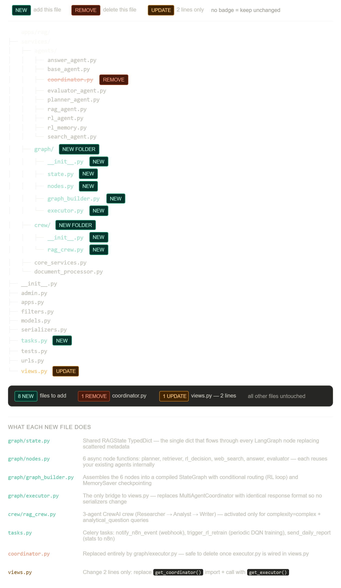

🚀 Project Title

DQN-RAG LangGraph Multi-Agent AI Platform with Secure Auth System

📌 Overview

This project is a production-ready AI platform + authentication system that combines:

🔐 Secure user authentication (Django + JWT)
🤖 Intelligent multi-agent orchestration (LangGraph)
🧠 Reinforcement Learning (DQN-based decision engine)
⚡ Parallel retrieval (RAG + Web Search)
🔄 Workflow automation (n8n)

It enables AI chatbots that dynamically decide whether to:

retrieve more information
search the web
or directly answer

➡️ Result: lower API cost + higher accuracy

🧠 Core Idea (Simple Explanation)

I build AI chatbots that intelligently decide when to search for more data and when to answer, reducing API costs and improving accuracy.

---------------------------------------------

DQN-RAG → LangGraph Multi-Agent Platform:

User Query
    │
    ▼
n8n Workflow Trigger
    │
    ▼
Django REST API (FastAPI optional)
    │
    ▼
LangGraph Orchestrator
    ├── PlannerNode      → classifies query, builds execution plan
    ├── RetrieverNode    → ChromaDB vector search
    ├── WebSearchNode    → Tavily internet search (parallel)
    ├── EvaluatorNode    → scores quality (factuality, hallucination)
    ├── AnswerNode       → generates final answer
    └── RLDecisionNode   → DQN decides: retrieve more / re-rank / answer
         │
         ▼
    Redis Cache + PostgreSQL + ChromaDB
         │
         ▼
    n8n → Slack / Email / Webhook notifications

⚙️ Key Features
🔐 Authentication System
User Registration & Login
JWT-based Authentication (Access + Refresh Tokens)
Password Reset (OTP आधारित verification)
Secure Logout
Built with Django + PostgreSQL + Next.js 14

🤖 Multi-Agent AI System
Agents:
PlannerAgent → decides workflow
RAGAgent → retrieves from vector DB
SearchAgent → fetches real-time web data
EvaluatorAgent → scores output quality
AnswerAgent → generates final response
RLAgent (DQN) → learns best decisions

🧠 Reinforcement Learning Upgrade (DQN)
Improvements over basic RL:
Neural Q-Network instead of table-based Q-learning
6-dimensional state representation
Target network for stability
Pretrained on ~800 synthetic samples
Real reward from LLM evaluation

RL decides:
Retrieve more data?
Use web search?
Answer now?
Re-rank results?
📊 Evaluation System

EvaluatorAgent scores responses based on:

Factuality
Coverage
Hallucination Risk
Conciseness

➡️ This score becomes the reward signal for RL training

📂 Project Structure (Aligned with Your Image)
🔹 agents/

Core AI logic

planner_agent.py
rag_agent.py
search_agent.py
evaluator_agent.py
answer_agent.py
rl_agent.py
rl_memory.py

🔹 graph/ (LangGraph Layer - NEW)
state.py → shared state across nodes
nodes.py → all node logic (planner, retriever, etc.)
graph_builder.py → builds LangGraph workflow
executor.py → replaces old coordinator

🔹 crew/ (Optional AI roles)
rag_crew.py → Researcher → Analyst → Writer flow

🔹 services/
document_processor.py
core_services.py

🔹 Django Layer
models.py
serializers.py
views.py (UPDATED → now uses executor)
tasks.py (Celery async tasks)

🧾 Short Resume Version (Use This)

AI Engineer | Multi-Agent Systems | RL + RAG

Built a DQN-powered multi-agent AI platform using LangGraph that dynamically decides when to retrieve data, perform web search, or generate responses—reducing API costs and improving answer accuracy. Integrated Django-based authentication, Celery workflows, and n8n automation for a production-ready system.

Structure Image:

------------------------------------------------------